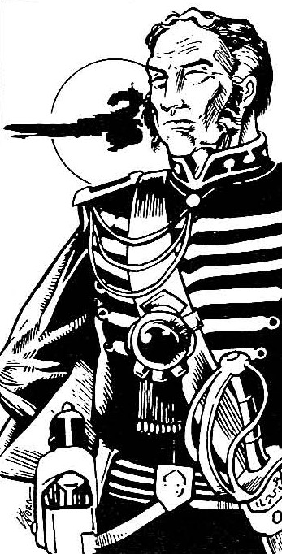

```{r setup, include=FALSE}
knitr::opts_chunk$set(echo = FALSE)
setwd('/Users/Frankie/Documents/School/Stat 133/Warmup 01/')
```

##Starwars
```{r pressure, echo=FALSE, out.width = '25%', fig.align="center"}

```

A famous qute by Horzao Darr: 

&nbsp;&nbsp;&nbsp;&nbsp;&nbsp;&nbsp;"This world is called Exocron. You are welcome here, as are others of your kind."

Description | Value
------------- | -------------
Species | Human
Gender | Male
Homeworld | Exocron
Era | New Republic Era

##Cooking Recipe
#####Cosmopolitan Recipe


######Ingredients
* 3 ounces (6 tablespoons) vodka, Citron or plain
* 1.5 ounces (3 tablespoons) Cointreau or Triple Sec
* 1.5 ounces (3 tablespoons) lime juice
* 3 ounces (6 tablespoons) cranberry or pomegranate juice
* Ice

######Tools
* Martini glass
* Cocktail shaker
* Hawthorne Strainer

######Instructions
1. Chill glass in freezer till needed
2. Place ingredients and ice in a cocktail shaker
3. Shake until everything is cold
4. Strain drink into chilled glass and serve
5. Garnish with lime or lemon peel

######Comments
* Orginiated from the 1930s
* Popularized by _Sex and the City_
* Originally included cranberry juice, modern iterations utilize pomegrante juice
* Other variations include stirring in a mixing glass, rather than shaking 

##Eucledian Distance
The __Euclidean distance__ between points $\mathbf{p}$ and $\mathbf{q}$, is the length of the line segment connecting them ($\overline{\mathbf{p}\mathbf{q}}$). 

In Cartesian coordinates, if $\mathbf{p} = (p_1, p_2,..., p_n)$ and $\mathbf{q} = (q_1, q_2,..., q_n)$ are two points in Euclidean $n$-space, then the distance (d) from $\mathbf{p}$ to $\mathbf{q}$, or from $\mathbf{p}$ to $\mathbf{q}$ is given by the Pythagorean formula: 


$$
d(\mathbf{p}, \mathbf{q}) = d(\mathbf{q}, \mathbf{qp}) = {\sqrt{(q_1 - p_1)^2 + (q_2 - p_2)^2 + {...} + (q_n - p_n)^2}}
$$
$$
=\sqrt{\sum_{i=1}^{n}(q_i - p_i)^2  }
$$

The position of a point in a Euclidean $n$-space is a Euclidean vector. So, $\mathbf{p}$ and $\mathbf{q}$ may be represented as Euclidean vectors, starting from the origin of the space (initial point) with their tips (terminal points) ending at the two points. The __Euclidean norm__, or __Euclidean length__, or __magnitude__ of a vector measures the length of the vector:

$$
\left\|{\mathbf  {p}}\right\|={\sqrt  {p_{1}^{2}+p_{2}^{2}+\cdots +p_{n}^{2}}}={\sqrt  {{\mathbf{p}}\cdot {\mathbf{p}}}},
$$


