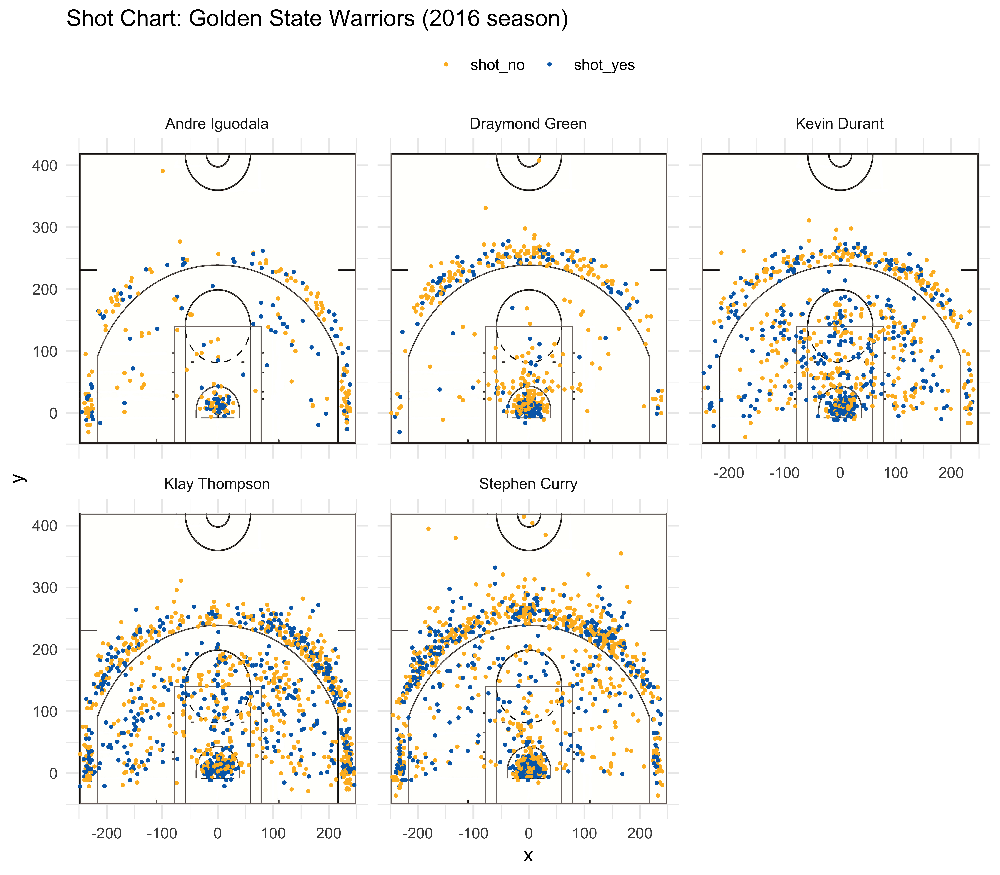

```{r setup, include=FALSE}
knitr::opts_chunk$set(echo = TRUE)
```

```{r packages, include = FALSE}
library(dplyr)
library(ggplot2)
library(knitr)
```

# Introduction
```{r, echo = FALSE, fig.align='center'}
include_graphics('../images/warriors-starting-5.jpg')
```


The Golden State Warriors have been the dominant face of the NBA for the past few years with three championships in the past four years.  Spouting a roster that has at least three All-Stars every year since their unprecedented and historic run the Golden State Warriors, along with coach Steve Kerr, have solidified their position as a dynasty within the NBA. Even coming to topple the King himself, Lebron James, and effectively changing the composition of the league, the Warriors have left their mark on history. But with rumblings across the league and ever shifting landscape that is basketball, all dynasties are destined to come to an end.  

# Background/Motivation

With rumors of trades along the lines of Kevin Durant to the New York Knicks, Klay Thompson to Los Angeles, or even Draymond Green out of the team once and for all, the league may be in for another historical shift in power. Though many of these trades are speculation as the trade deadline has come and pass for this season, it still begs the question of how and why the Golden State Warriors became and remained a dominant team. In this report, we hope to dissect how Golden State’s five starters impact the game and particularly the impact they had during the 2016 season. In this report we present data and analysis on the Golden State Warrior to dissect what makes the team so successful. 

# Data
```{r, include = TRUE}
shots_data <-  as.tbl(read.csv("../data/shots-data.csv", row.names = 1))

kable(head(shots_data))
```

Utilizing shot level data from the team’s 2016 season, we hope to take a look a critical factors that the make the Warriors what they are. In this report we focus on five major players: Stephen Curry, Klay Thompson, Kevin Durant, Draymond Green, and Andre Iguodala, the famous starting five for the Warriors.  All these players have been extremely valuable for the Warriors, though each in a different way. 

# Charts
### Two Point Efficiency
```{r 2 point}
kable(
shots_data %>%
  filter(shot_type == "2PT Field Goal") %>%
  group_by(name) %>%
  summarise(total = n(),
            made = sum(shot_made_flag == "shot_yes"),
            percentage = paste0(round(made/total*100, 1), "%")) %>%
  arrange(desc(percentage)),
caption = "2PT Efficiency"
)
```

### Three Point Efficiency
```{r 3 point}
kable(
shots_data %>%
  filter(shot_type == "3PT Field Goal") %>%
  group_by(name) %>%
  summarise(total = n(),
            made = sum(shot_made_flag == "shot_yes"),
            percentage = paste0(round(made/total*100, 1), "%")) %>%
  arrange(desc(percentage))
)
```

### Overall Efficiency
```{r overall}
kable(
shots_data %>%
  group_by(name) %>%
  summarise(total = n(),
            made = sum(shot_made_flag == "shot_yes"),
            percentage = paste0(round(made/total*100, 1), "%")) %>%
  arrange(desc(percentage))
)
```

# Analysis
```{r, echo = FALSE, fig.align='center'}

```


In our diagram above we show the shot distribution of the players. Note that each of the players has a very different shot pattern. Iguodala and Green, as expected, seem to play off the ball a lot more than the other players, with Iguodala taking the least amount of shots of all the five starters. However, it is abundantly clear that with Iguodala’s high shot percentage in both the 2 point range as well as overall, shows that he only takes shots that he feels comfortable taking.  These numbers rank in the top 2 for the player analyzed sitting at 63.8% and 51.8% respectively. It is still important to note however, that Iguodala does not attempt many shots in the first place and thus his presence on the field is often characterized an extremely capable off-the-ball player. 

Differing from Iguodala, Green not only takes more shots but plays as a hybrid interior shooter. Green typically prefers to take shots from either outside the perimeter or inside the paint, with little attempts made in the spaces in between. Taking far more shots, however, has quite a few consequences as Draymond Green, in all aspects, is not an accurate shooter. Sitting dead last in efficiency for all shot categories, Drayond’s strength isn’t really with his shot, but rather much like Iguodala, the off the ball play. 

On the other hand, when taking a look at the primary scorers for the Golden State Warriors, we begin to observe two very different archetypes. The first of which is the mid range shooter. This type of player, though taking a fair number of shots outside the perimeter and in the paint, isn’t afraid to shoot from the inside the perimeter. The other archetype is the three-point shooter. This player prioritizes the 3-point shot over most other shots and thus is marked by an extraordinary large number of shows outside the perimeter. 

Taking those archetypes into account, it is very easy to see that Kevin Durant is a perfect fit for the mid range shooter.  Though he takes quite a few number of three-pointers, as does every player on the Golden State Warriors, Durant succeeds with being able to make a shot from anywhere. When diving further and taking look at his shot percentages in the tables below, we note that Durant is one of the most effective shooters on the team. When it comes to the two point shot, not only does he have one of the highest shot percentages at 60.7%, he records the most shots taken at that range. This leads Durant to hold an extremely impressive overall shot percentage and leading the team at 54.1%. 

Taking a look at probably the most popular player on the team, Stephen Curry, we see the mold of the new super star—the three-point shooter. Taking 50% shots outside the perimeter than shots taken in inside the line, Curry is the definition of a new age player. Shooting at 40.8% from the three makes Curry one of the deadliest players in the league. This, however does not mean he is invincible, despite having a great touch beyond the perimeter, Curry’s shot percentage from the two is drastically lower than both Andrew Iguodala’s and Kevin Durant’s, sitting at only 54% compared to 63% and 60% respectively. 

Though Curry is the face of the team, there is one player that beats even him from beyond the perimeter, Klay Thompson. With comparable shot frequencies across the board, Klay surpasses Curry in terms of efficiency in both the three-pointer and the overall, only losing out slightly in terms of two-point percentage. Klay represents himself as a true star without the ego being a viable second threat that’s just as deadly as the first. 

# Discussion

From these limited stats alone, we begin to see the image of an extremely formidable basketball team arise. With a healthy dose of extremely strong off the ball players such as Green and Iguodala and deadly shooters such as Klay, Durant, and Curry, the Golden State Warriors are almost without fault. With great shooting percentages inside the paint and both inside and out of the perimeter, it becomes apparent why the Warriors have been able to dominate the NBA scene for so long. The lack ego and the raw talent with regards to the starting five makes this team truly unbeatable. Being able to spread the floor like no other, the Warriors are deadly at no matter the distance from the rim. 

# Conclusion

In all, the accumulation of talent on the Golden State Warriors has been nothing but extraordinary. Playing around the three-point ball, the team has successful changed the mindset of the league and become the reigning kings of the court. When this dynasty comes to an end, we will all remember the Golden State Warriors as the team that defied the logic when it came to crafting a roster. Implementing players and a system that had never been thought of, the Warriors truly shifted the NBA into a new era. 

#References
Images: Getty Images